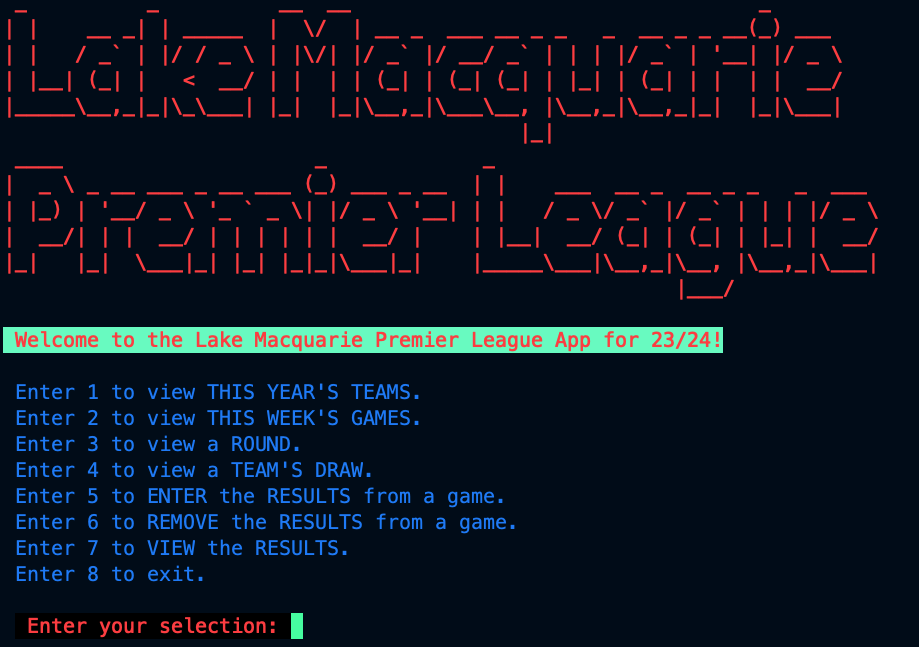
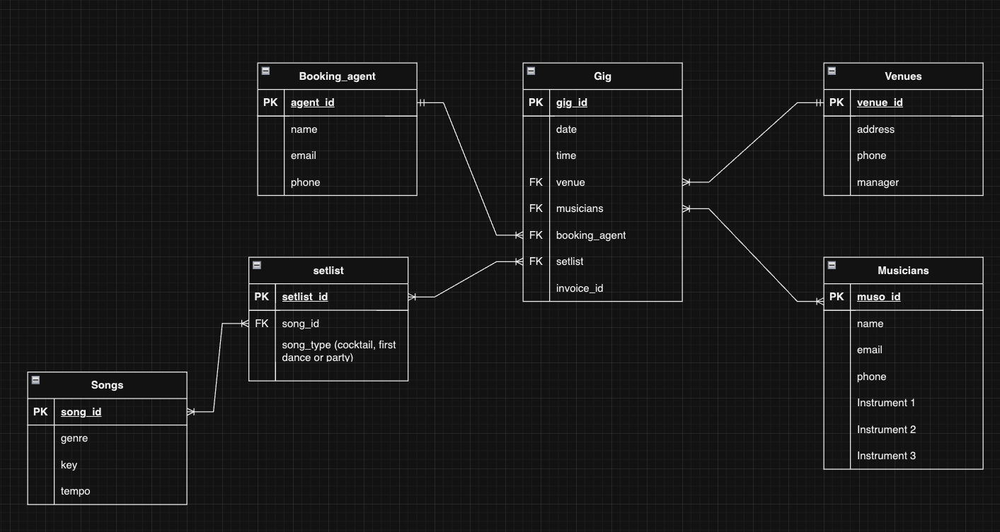
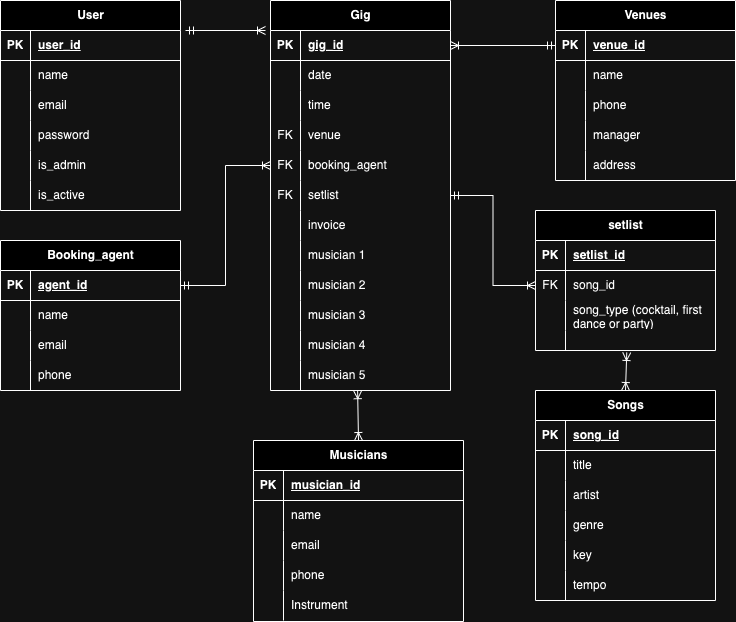

# Reece Doyle T3A1
***
## Question 1
***
	Provide an overview and description of a standard source control process for a large project
***


This feels like it's asking for a GitHub workflow.  Source control, branching features,


***
### References

***
<div style="page-break-after: always;"></div>

## Question 2
***
	What are the most important aspects of quality software?
***
This feels like a straight google search
Research
Reference articles
***
### References

***
<div style="page-break-after: always;"></div>


## Question 3
***
	Outline a standard high level structure for a MERN stack application and explain the components
***
Full stack applications. "3 apps in a trench coat"

***
### References

***
<div style="page-break-after: always;"></div>

## Question 4
***
	A team is about to engage in a project, developing a website for a small business. What knowledge and skills would they need in order to develop the project?
***
"Effectively describes a range of skills and knowledge required by IT workers to complete a quality web development project"

Designing a website for a small business is a very broad topic that could be taken in many different directions. In relation specifically to the skills and knowledge required of a developer or team to deploy such a website, it would be assumed that the following had already been decided by the client or team leader:

* The purpose of the website,
* The Domain and host,
* The design elements, sketched out in a wireframe, with colours, possibly on Figma, specifying in as much detail as possible how many pages are required, what will be on them, and how they will be mapped,  
* Copy for the website,
* Assets required for the website (logos, pictures, videos and fonts.)
* Deadlines and milestones to complete the project.
* The organisational method for meeting those milestones (possibly Agile with a Kanban board. Trello etc.)
* Clearly defined tasks and responsibilities broken down amongst team members. 

A small business website will require team members with both Front End and Back End skills. This could be two dedicated people, or possible a single person. Depending on the size of the project, the size of the team would be scaled accordingly. 

#### Front End Skills

The Front End is the part of the website that is user facing. The part that looks pretty!
In order to create a successful User Experience, the Front End developer would require some level of proficiency in:
1.  HTML/CSS (Hyper Text Markup Language & Cascading Style Sheets): These are the languages that determine what the structure and styling of the website is going to look like. HTML deals mostly with the the structure, and as the name would indicate, CSS deals with the styling. 
2. JavaScript: This is the programming language used in conjunction with HTML and CSS used to make dynamic web applications. 
3. Responsive Design: This is to determine how well the website works on different devices. Will the website work if it is viewed on a phone? As mobile devices have become far more prevalent than desktop computers, Mobile First Design has become the way many Developers approach their designs. 
4. Cross-Browser Compatibility:  Your website might look good in Chrome, but it also needs to work on Firefox, Safari, and Microsoft Edge. Developers need to be sure that their code works consistently across all the major web browsers.
5. Design skills: While a Web Dev might not be expected to be the person to design a website, it's inevitable that some design may come up along the way. This could be a feature that the client has missed, or possibly that something that isn't working. It would be beneficial for a Web Dev to have some ability to create their own designs to help communicate with the client.
#### Back End Skills

While the Front End makes the Web App usable and aesthetically pleasing, the Back End is the "plumbing" and "boiler-room" that actually makes the Web App work. This is the part that makes the User Experience possible. You will need some proficiency in:
1. Programming Languages: This could be Java, Python, Ruby, C# or many others that run server-side applications that manage the data that is being collected, called and displayed.
   
2. Databases: This could be PostgreSQL, MySQL, Oracle, MongoDB or some other kind of Relational Database. The Back End Dev will need to know how to query, store and retrieve data effectively. 
   
3. Web-servers: Back End Devs need a good knowledge of server side scripting and how to configure and manage servers. This could be Apache or Ngnix.
   
4. APIs (Application Programming Interfaces): Back End Devs must be able to build and use APIs, which are used as a means of communicating between different systems. e.g. Connecting a PostgrSQL database to a website, and allowing the user the ability to Create, Read, Update and Delete entries on the Database. 

#### Common Skills to both Front End and Back End Web Devs

Front End Dev and Back End Dev responsibilities can be split across two different people to take advantage of the strengths of each. Those who are strong with UI/UE (User Interface/User Experience) might not be as strong with Back End, and vice verse. Some developers might choose to specialise in Front End or Back End, or work within either specialised role in a larger project. 

Some of the common skills that both kinds of Dev need to have are:

1. Version Control: Devs need to be masters of a version control like Git and GitHub to allow for a successful workflow, regardless of whether or not they're working by themselves or within a team. This allows for the code to be backed up, reviewed, iterated and improved all from a single place. it solves the issues that can come up with multiple people working on a project, but also is a way of backing up data from the local machine.
    
2. Problem Solving: It almost goes without saying that problem solving is one of the most important soft skills that any kind of Web Dev needs to master in order to be effective. An effective Dev will be able to problem solve their way out of most situations. You need to be able to reach into the large repository of knowledge that is available on forums like Stack Overflow, as it's highly likely that someone else has experienced the problem you're having before. The integration of AI into many workflows now means that most workers (not just IT) will have to become very good at prompting AI to speed up (but not replace) their workflows.
   
3.  Communication: Devs need to be able to effectively communicate with all stakeholders of the project to have the deliverables ready on time. This should be an incremental process where communication happens at regular intervals. This could be in the form of a Standup meeting, within emails, face-to-face, within GitHub for code reviews from the Head Developer or even across organisations. There should be some clear guidelines for where communication occurs, and when it happens. There's nothing worse than having to dig through an email chain only to find that you've been working on the wrong feature, or solving a problem that's already been solved by someone else. 
   
4. Testing and Debugging: While this might more commonly be associated with Back End Devs, where Test-Driven Design dictates that the first element of a design is the the test to prove that a function works, this is also apart of a Front End Dev's work day. Coding should be created in such a way that it can be tested, and is labeled with as many comments as necessary such that a Dev that has never seen the code can figure out how it works, or that the Dev who wrote it can come back years later and pick up where they left off. 
5. Security: A good knowledge of designs that will open up a website to cyber attqa


developing a website for a small business. 
Possibly look at the marriage celebrant website. 

***
### References

***
<div style="page-break-after: always;"></div>

## Question 5
***
	With reference to one of your own projects, discuss what knowledge or skills were required to complete your project, and to overcome challenges
***
CMP1043-3.2 Within your own project what knowledge or skills were required to complete your project, and overcome challenges?

"Effectively describes a range of skills and knowledge used to complete a project."


My first command line app was the Lake Macquarie Premier League app, which was written in Python for the T1A3 assignment. 

The Lake Macquarie Premier League app is designed to be used by an administrator of an amateur Football (Soccer) competition in Lake Macquarie, NSW, Australia.

It is designed to efficiently handle data for a 14 Round season among 8 local teams. Each team plays the 7 other teams in the competition twice per year, once at their home ground, and once as the away team at their opponents home ground, for a total of 56 games, played from November 2023 to March 2024.

The goal was to make the data for the entire season easy to store, and retrieve at a moments notice, based on a few predicted user stories:

- The administrator who wants to be able to store results in a simple CSV that could then be used to feed an Excel Spreadsheet.
- The fan, who wants to how many teams are in the competition and who they are. They will also be able to look up the games occurring in the coming week, or many weeks into the future. The may also want to check games that have already happened.
- The player, who wants to be able to plan their life around the games and wants to access easily where they'll be playing for the whole season in advance, and also look back at where they played.
- Any of the above users who want to be able to view a running tally of results of the games throughout the season.

To meet all of these user stories, I decided that their would need to be 7 features in total:

1. Teams Competing
2. Games this week
3. Display Rounds
4. Display the Draw for a particular team
5. Enter Results of a game
6. Delete Results of a game
7. View the current results in a table

***
## Skills
At a more Macro level, most of the skills I had to develop to complete this task were:
* Python Syntax
* How to import from packages and other python files
* The Syntax for the packages I imported
* While loops, 
* Try and Except Blocks
* Testing


Analysing the code from the home screen is probably the most efficient way of getting to each of the skills required to develop this app. 

```python
from colored import fore, back, attr
from lmpl_functions import (
    print_teams, print_this_round, print_round, team_draw,
    enter_results, edit_results, view_results
)
import pyfiglet as pfg
import csv

# App Logo
text = pfg.print_figlet(text = "Lake Macquarie Premier League", font = "standard", colors = "red")

# App Greeting
print(f"{fore('red')}{back('white')} Welcome to the Lake Macquarie Premier League App for 23/24!{attr('reset')}\n")

file_name = "results.csv"

try:
    # open the file in read mode
    results = open(file_name, "r")
    results.close()
    # print("In try block")
    # if it throws an error, the file doesn't exist
    # if no error, the files exists
except FileNotFoundError:
    # Now, we know the file doesn't exist
    # Create a new file
    results = open(file_name, "w")
    results.write("Game Number,Home Team,Home Goals,Away Team,Away Goals\n")
    results.close()
    # print("In except block")

def create_menu():
    print(f"{fore('blue')} Enter 1 to view THIS YEAR'S TEAMS. {attr('reset')}")
    print(f"{fore('blue')} Enter 2 to view THIS WEEK'S GAMES. {attr('reset')}")
    print(f"{fore('blue')} Enter 3 to view a ROUND. {attr('reset')}")
    print(f"{fore('blue')} Enter 4 to view a TEAM'S DRAW. {attr('reset')}")
    print(f"{fore('blue')} Enter 5 to ENTER the RESULTS from a game.  {attr('reset')}")
    print(f"{fore('blue')} Enter 6 to REMOVE the RESULTS from a game.  {attr('reset')}")
    print(f"{fore('blue')} Enter 7 to VIEW the RESULTS.  {attr('reset')}")
    print(f"{fore('blue')} Enter 8 to exit.\n")
    choice = input(f"{fore('red')} {back('16')} Enter your selection: {attr('reset')}" "")
    return choice

users_choice = ""

while users_choice != "8":
    users_choice = create_menu()
    if (users_choice == "1"):
        print_teams()
    elif (users_choice == "2"):
        print_this_round()
    elif (users_choice == "3"):
        print_round()
    elif (users_choice == "4"):
        team_draw()
    elif (users_choice == "5"):
        enter_results(file_name)
    elif (users_choice == "6"):
        edit_results()
    elif (users_choice == "7"):
        view_results()
    elif (users_choice == "8"):
        continue
    else:
        print("Invalid Input")
```

### Imports

First I had to learn how to `import` properly. Rather than just having the app in a single file, I broke it into several: `main.py`, `lmpl_functions.py` and `test_lmpl_fucntions`. Each of the functions that are selectable from the home screen are in the `lmpl_functions` file and listed as `imports` below. 
```python
from lmpl_functions import (
    print_teams, print_this_round, print_round, team_draw,
    enter_results, edit_results, view_results
)
```

I also had to import these 3 packages: `colored`, `pyfiglet`, and `csv`.

```python
from colored import fore, back, attr
import pyfiglet as pfg
import csv
```
#### Colored
Learning to use `colored` allowed me to change the colours of the text in my app. This was especially helpful with readability. It also allowed me to make the team names reflect the team colours in the `print_teams`, `team draw`, and the `enter_results` functions.

`fore, back` allowed me to make the Greeting and the menu selections have a different background and text colour. 
 ```python
 # App Greeting
print(f"{fore('red')}{back('white')} Welcome to the Lake Macquarie Premier League App for 23/24!{attr('reset')}\n")
```
This gave my greeting red text and a white background.
NB: the background appears green in my screenshot above because I'm using the `powerlevel10k` theme from `Oh My Zsh` on my local machine. 

I used `colored` for the menu selections on the homepage to make the Blue as well:
```python
print(f"{fore('blue')} Enter 1 to view THIS YEAR'S TEAMS. {attr('reset')}")
```

#### PyFiglet
`Pyfiglet` was another package I had to learn to use to create the logo. I believe `Pyfiglet` is a version of a more popular package called `figlet`, optimised for Python. The syntax was rather simple, and allowed me to create the red `Lake Macquarie Premier League` logo above with only that single line of code. I also used it to make the exit screen logo, which simply reads `L.M.P.L Thank You!`


```python
import pyfiglet as pfg
# App Logo
text = pfg.print_figlet(text = "Lake Macquarie Premier League", font = "standard", colors = "red")
```

#### CSV
Most of this app relies on manipulating and viewing the data in a CSV file, therefore it was crucial to learn to use `csv`.

```python
file_name = "results.csv"

try:
    # open the file in read mode
    results = open(file_name, "r")
    results.close()
    # print("In try block")
    # if it throws an error, the file doesn't exist
    # if no error, the files exists
except FileNotFoundError:
    # Now, we know the file doesn't exist
    # Create a new file
    results = open(file_name, "w")
    results.write("Game Number,Home Team,Home Goals,Away Team,Away Goals\n")
    results.close()
    # print("In except block")
```

When the app is activated the first thing it does is look for a file called `results.csv`. If it exists, it opens the file in `read mode`, invoked by `results = open(file_name, "r")`and then closes it with `results.close()`. 

If the file doesn't exist, it creates the file with `results = open(file_namem "w")`, writes the column names with `results.write("Game Number,Home Team,Home Goals,Away Team,Away Goals\n")` and then closes the file with `results.close()`.


#### Try and except blocks

The Macro skill I had to learn above this was also `Try` and `Except` blocks and error handling. Without this, the app would throw errors when it didn't find the `results.csv` file and crash. 

#### While Loops

Another skill I had to learn was how to make `while` loops. This was used for the selection menu.
```python
users_choice = ""

while users_choice != "8":
    users_choice = create_menu()
    if (users_choice == "1"):
        print_teams()
    elif (users_choice == "2"):
        print_this_round()
    elif (users_choice == "3"):
        print_round()
    elif (users_choice == "4"):
        team_draw()
    elif (users_choice == "5"):
        enter_results(file_name)
    elif (users_choice == "6"):
        edit_results()
    elif (users_choice == "7"):
        view_results()
    elif (users_choice == "8"):
        continue
    else:
        print("Invalid Input")
```

First I had to establish the variable of `users_choice` having a value of `""`, which is essentially nothing. This was so we could call it in the `while` loop. 

 decided that `8` would be what I used to exit the menu, so I used the logic `while users_choice != "8":` to mean "while the users choice isn't 8". A selection of `8` would send you into the `elif` block of `elif (users_choice == "8"): continue`. The `continue` would send you into a print function at the end of the app, once again using `pyfiglet` to create a farewell:
 ```python
 # App Fareweall and Logo

print("\n")

print(f"{fore('red')} {back('white')} Thank you for using the Lake Macquarie Premier League App! {attr('reset')}")

print("\n")

text = pfg.print_figlet(text = "Thank You !\n\nL . M . P . L", font = "standard", colors = "red")
```

The rest of the `elif` loops would invoke the respective functions. 

In order to error handle, I had the `else: print("Invalid Input")`, meaning anything other than a number from 1-8 would send the user into the else loop. 

#### Date Time
On the functions page, I used Python's built in `datetime` package to solve a problem I was having. I wanted to create a function that printed only the games that were occurring in that particular week. I wanted the user to be able to look on a Tuesday what games were being played on the weekend. 

As I'd already defined the games by game numbers and dates, the most obvious way to create a grouping that would print easily was to use `week_num`  in `datetime`. 

First it would print the date , then use `isocalendar` to determine the week of the year. Each week of the year has a week number (first week of the year is week 1, last week of the year is week 52, sometimes 53 if it's a leap year). 


```python
def print_this_round():
from datetime import date

# Show actual date

my_date = datetime.date.today()
today = date.today()
print(today.strftime(f"\nToday's date is %A %d %B %Y"))

# Using isocalendar() function

year, week_num, day_of_week = my_date.isocalendar()
print(f"\nIt is week #" + str(week_num) + " for the year\n")
print("This week's games are: ")
found_games = False # Variable to track if any games are found

with open("lmpl.csv", "r") as f:
reader = csv.reader(f)
for row in reader:
if row[0] == str(week_num):
print("\n" "Round " + row[1] + "," + " " + "Game" + " " + row[2] + "," + " " + row[3] + " " + "vs" + " " + row[4] + " " + row[5] + "," + " " + row[6] + "," + " " + row[7])
print("\n")

found_games = True # Set to True if at least one game is found

if not found_games and week_num in range(6, 43):
print("No Games this week.")
```

Once the `week_num` was determined, the week of the year would be printed, as long as the `week_num` was in the range of 6 and 43. This was because the competition ran from week 44 of the year to week 5 of the following year. 

I stored the draw for the competition in a seperate csv file called `lmpl.csv`. This meant I had to add an extra column to my `lmpl.csv`, but it was well worth it for this functionality:

```python
Week,Round,Game Number,Home Team,Away Team,Day,Date,Time
44,1,1,Belmont Bandits,Boolaroo Bulldogs,Friday,3/11/23,18:00
44,1,2,Charlestown Cobras,Eleebana Eagles,Saturday,4/11/23,12:00
44,1,3,Glendale Guardians,Speers Point Spartans,Saturday,4/11/23,15:00
44,1,4,Swansea Silverbacks,Warners Bay Wanderers,Sunday,5/11/23,14:00
45,2,5,Boolaroo Bulldogs,Charlestown Cobras,Friday,10/11/23,18:00
45,2,6,Eleebana Eagles,Glendale Guardians,Saturday,11/11/23,12:00
45,2,7,Speers Point Spartans,Swansea Silverbacks,Saturday,11/11/23,15:00
45,2,8,Warners Bay Wanderers,Belmont Bandits,Sunday,12/11/23,14:00
46,3,9,Belmont Bandits,Charlestown Cobras,Friday,17/11/23,18:00
46,3,10,Boolaroo Bulldogs,Eleebana Eagles,Saturday,18/11/23,12:00
46,3,11,Glendale Guardians,Swansea Silverbacks,Sunday,19/11/23,14:00
46,3,12,Speers Point Spartans,Warners Bay Wanderers,Friday,24/11/23,18:00
```

I once again used the `csv reader` to look at the `lmpl.csv` and print out the games with that corresponding `week_num` in the format below:
```python with open("lmpl.csv", "r") as f:
reader = csv.reader(f)
for row in reader:
if row[0] == str(week_num):
print("\n" "Round " + row[1] + "," + " " + "Game" + " " + row[2] + "," + " " + row[3] + " " + "vs" + " " + row[4] + " " + row[5] + "," + " " + row[6] + "," + " " + row[7])
print("\n")

```

### Testing

As most of my functions were reading and writing based, they were difficult to write tests for. However, I was able to create a test for the above `print_this_round` function. 

As I was using real time data, I had to come up with a test that would force the function to throw the negative `No Games this week` print statement. 

To do this, I simply copied the code, commented out what I didn't need, and declared `week_num = week_num_to_test`. I then declared `week_num_to_test = 10`. This meant the function stayed as intact as humanly possible. As 10 is outside of the range of 6 and 43, it printed `No Games this week`. Considering this project was delivered in late December 2023, the only way to prove this function had been error handled gracefully would've been to wait until late February 2024. Obviously not ideal. 

```python
import csv
# import datetime

def print_this_round():
	# from datetime import date
	# # Show actual date
	# my_date = datetime.date.today()
	# print(my_date)
	# # Using isocalendar() function
	# year, week_num, day_of_week = my_date.isocal`endar()
	# print("Week #" + str(week_num))
	# print("This week's games are: ")

	week_num = week_num_to_test

	found_games = False # Variable to track if any games are found

	with open("lmpl.csv", "r") as f:
		reader = csv.reader(f)
		for row in reader:
			if row[0] == str(week_num):
				print("\n" "Round " + row[1] + "," + " " + "Game" + " " + row[2]
						 + "," + " " + row[3] + " " + "vs" + " " + row[4] + " " 
						 + row[5] + "," + " " + row[6] + "," + " " + row[7])
			print("\n")
			found_games = True # Set to True if at least one game is found

	if not found_games and week_num in range(6, 43):
		print("No Games this week.")

# Test the function with a specific week_num value
week_num_to_test = 10 # Change this to the desired week number
print_this_round()
```


***
<div style="page-break-after: always;"></div>

## Question 6
***
	With reference to one of your own projects, evaluate how effective your knowledge and skills were for this project, and suggest changes or improvements for future projects of a similar nature
***

"Evaluates effectiveness of knowledge and skills accurately, providing examples, and providing an insightful improvement on each skill"

My Term 2 Flask app started with the best of intentions......

I've worked as a performing musician for hire since I was 17. I've done hundreds of gigs in numerous settings, but almost always playing covers for events, parties, or in pubs and clubs. 

Over time I've gone from being a "fill-in" musician working with whoever will have me to running my own bands. Working for other people allowed to see how my friends and colleagues ran their bands. I picked the best parts of what they did and iterated them into my own policies and procedures. 

Weddings are my favourite kinds of gigs to do, because you get to be a part of one of the most important days in a couple's life. There's always a crowd. There's always a vibe.  And the pay is great, but it's a very high stakes gig and I've played in some train-wrecks...(other peoples gigs. Not mine of course.....) which can be catastrophic for a wedding vendor. All it takes is one bad review to potentially sink your business. 

My goal was to create an app that would allow me to streamline the many tasks a wedding band manager/musician would likely encounter in the planning phase, thus maximising our ability to deliver a high quality performance on the day. 

All wedding gigs have essentially the same elements that fit nicely into a relational database. 
This was my initial ERD:

The goal was that I would be able to record all the data needed for the gig in a relational database. This included the venue, booking agent, the musicians playing, the setlist we were going to play, and the function of that setlist (cocktail hour, first dance, or party). I was going to then have a list of songs in a database that would allow us to store the information I needed for each song. This would correspond to a collection of songs I would have PDF charts for. 

All paths flowed back to the "gig" itself. By looking up a single gig entry, I could everything I needed to know about a given gig. 

One of the major problems I encountered when I actually went about building this API is that I had a mistake in the relationship between the `setlist` and `songs` tables. This is a Many-to-Many relationship which required a join table between them. 

I can now say from experience that join tables are much harder to make work than I anticipated, and were well above my skill set at the time (or even now for that matter, as I haven't revisited them!).

On review of the lecture recordings I watched to try and work out why I couldn't make the join tables work, I noticed Simon mention that he rarely, if ever had seen join tables used in a professional setting, as they introduce a level of complexity that is very difficult to troubleshoot effectively. 

With the deadline I had to meet, it was highly unlikely I was going to be able to create a functioning many-to-many join table, so I changed my design. 


......but not before trying to make a SECOND join table for the musicians....

I decided that I needed this table as my first design was only going to allow me to assign a single musician to each `Gig` entry, which was not fit for purpose, as all each entry was going to have at least 2 musicians at it. My solution was to add a `Band` table. This was to account for the nature of the work. It's not uncommon for wedding bands to have a different group of musicians for any given gig. 

I attempted to get around this by changing my design again, but to no avail....

This was my attempt to get around the join table between musicians and gigs, but (of course) the same problems came up again and again. 

At some point I also attempted to get around the join table for the `songs` and `setlist` table by creating 3 different tables. The problem I found here was that a `First Dance` song could be a `Cocktail Hour` etc. I had just created 3 versions of the same problem. 

Finally, I settled on a much simpler design where it was just many different One-to-Many relationships. I wasn't happy about it, but I was going to meet the deadline. 

I ended up with this:

No more join tables. I boiled the functionality down to just a few components. Every gig still had a `First Dance Song`, a `Aisle Song` and at least one `Musician` functioning as a "Band Leader". 

In retrospect, I wish I had mastered the join table, or designed something completely different. 

I think the main skill that I lacked for this task was my ability design an app that met the criteria and matched with my skillset in Flask, PSQL and Python. The initial design was way too complex. I fundamentally didn't understand the complexities of the Many-To-Many relationship in a relational database or who to correctly implement them. I bit off FAR more than I could chew. 

To my credit, I recognised my error and course corrected. I didn't "throw good money after bad".

I think if I were doing this project again, I would design a much simpler app. I would do either just the `Musicians` or just the `Setlists` components of the apps on their own. Each of these problems would have met the scope of the requirements of the assignment. 

I think I would've favoured the `Setlist` idea, as I would be able to take advantage of using the Spotify API, which allows you to populate the table with data about each song, specifically the `Title, Artist, Key, Genre, Tempo.` You can also take advantage of existing Wedding Playlists. 

Once I had confidence in making a smaller idea work, I would've gained the knowledge, skills and confidence to expand and iterate on my initial idea by adding more features. I might have eventually gotten to a point where I was able to use the Join Tables that would've bought my initial design into reality. 
***
<div style="page-break-after: always;"></div>

## Question 7
***
	Explain control flow, using an example from the JavaScript programming language
***


***
### References

***
<div style="page-break-after: always;"></div>


## Question 8
***
	Explain type coercion, using examples from the JavaScript programming language
***


***
### References

***
<div style="page-break-after: always;"></div>

<div style="page-break-after: always;"></div>


## Question 9
***
	Explain data types, using examples from the JavaScript programming language
***


***
### References

***

<div style="page-break-after: always;"></div>


## Question 10
***
	Explain how arrays can be manipulated in JavaScript, using examples from the JavaScript programming language
***


***
### References

***
<div style="page-break-after: always;"></div>


## Question 11
***
	Explain how objects can be manipulated in JavaScript, using examples from the JavaScript programming language
***


***
### References

***

<div style="page-break-after: always;"></div>


## Question 12
***
	Explain how JSON can be manipulated in JavaScript, using examples from the JavaScript programming language
***


***
### References

***

<div style="page-break-after: always;"></div>


## Question 13
***
	For the code snippet provided below, write comments for each line of code to explain its functionality. In your comments you must demonstrates your ability to recognise and identify functions, ranges and classes
***
```javascript
class Car { 
	constructor(brand) { 
		this.carname = brand; 
	} 
	present() { 
		return 'I have a ' + this.carname; 
	} 
} 

class Model extends Car { 
	constructor(brand, mod) { 
		super(brand); 
		this.model = mod; 
	} 
	show() { 
		return this.present() + ', it was made in ' + this.model; 
	} 
} 

let makes = ["Ford", "Holden", "Toyota"] 
let models = Array.from(new Array(40), (x,i) => i + 1980) 

function randomIntFromInterval(min,max) { // min and max included 
	return Math.floor(Math.random()*(max-min+1)+min);
} 

for (model of models) { 

	make = makes[randomIntFromInterval(0,makes.length-1)] 
	model = models[randomIntFromInterval(0,makes.length-1)] 
	
	mycar = new Model(make, model); 
	console.log(mycar.show()) 
}
```

***
### References

***